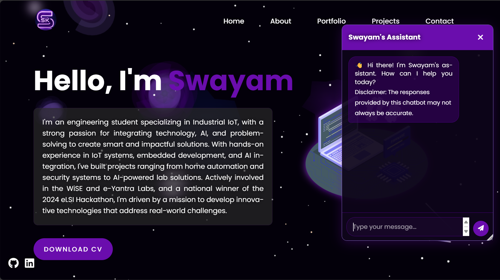
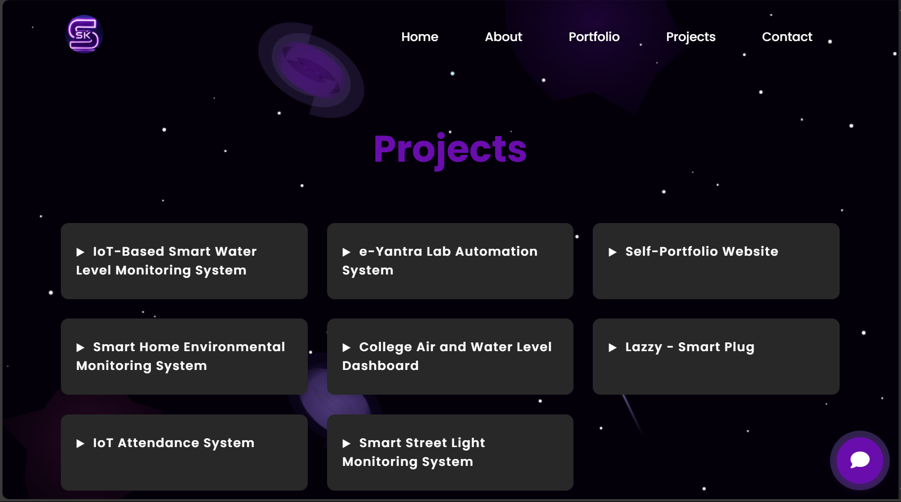
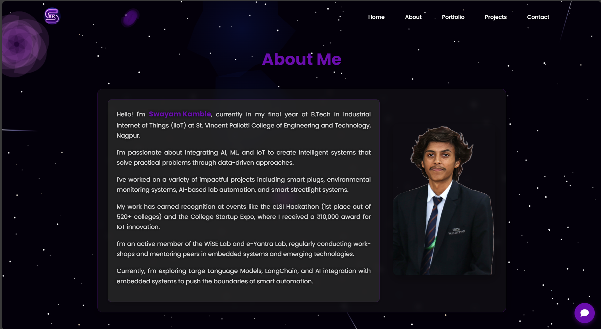
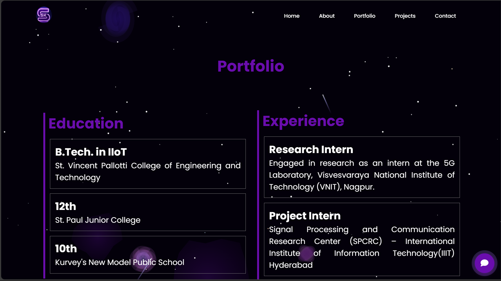

# 🚀 Swayam Kamble's Portfolio Website 

  

## 🌟 Overview

This is my personal portfolio website showcasing my projects, skills, and professional journey in Industrial IoT, embedded systems, and AI integration. Built with modern web technologies and featuring an interactive space-themed design with animated elements.

## ✨ Features

- 🌌 **Interactive Space Background** - Dynamic star field with animated galaxies and shooting stars
- 🤖 **AI-Powered Chatbot** - Custom assistant to interact with visitors
- 📱 **Fully Responsive Design** - Optimized for all devices from mobile to desktop
- 📁 **Project Showcase** - Detailed presentations of my technical projects
- 📊 **Interactive Elements** - Engaging user experience with animations and transitions
- 🔍 **SEO Optimized** - Enhanced discoverability through search engines

## 🛠️ Technologies Used

  
  
  

- **HTML5** - Structure and content
- **CSS3** - Styling with custom animations and responsive design
- **JavaScript** - Interactive elements and dynamic content
- **Canvas API** - Space-themed background animations
- **Backend Integration** - Chatbot functionality

## 📋 Pages

- **Home** - Introduction and overview
- **About** - Detailed background and skills
- **Portfolio** - Education, experience, and certifications
- **Projects** - Showcase of technical work
- **Contact** - Get in touch form and contact information

## 🏆 Featured Projects

- 🔬 **e-Yantra Lab Automation System** - 1st Place at eLSI Hackathon, IIT Bombay
- 💧 **IoT-Based Smart Water Level Monitoring** - IIIT Hyderabad internship project
- 🏠 **Smart Home Environmental Monitoring System**
- 💡 **Smart Street Light System**
- 🔌 **Smart Plug with Energy Monitoring**

## 📷 Screenshots

<table>
  <tr>
    <td></td>
    <td></td>
  </tr>
  <tr>
    <td></td>
    <td></td>
  </tr>
</table>

## 📞 Contact

- 📧 Email: swayamkambleofficial@gmail.com
- 💼 LinkedIn: [swayam-kamble-a536a0290](http://www.linkedin.com/in/swayam-kamble-a536a0290)
- 🐱 GitHub: [SwayamKamble](https://github.com/SwayamKamble)

## ⚖️ License

This project uses dual licensing to protect both code and content:

### Code License - MIT

All source code in this repository is licensed under the MIT License. This includes JavaScript files, CSS, and HTML structure.

The MIT License allows you to:
- Use the code commercially
- Modify the code
- Distribute the code
- Use the code privately

See [LICENSE-CODE.md](LICENSE-CODE.md) for the full MIT license text.

### Content License - CC BY-NC-ND 4.0

All non-code content in this repository is licensed under Creative Commons Attribution-NonCommercial-NoDerivatives 4.0 International License (CC BY-NC-ND 4.0). This includes:
- Text content
- Images and graphics
- Project descriptions
- Personal information
- Design elements

The CC BY-NC-ND 4.0 License means you can:
- Share the content with attribution
- Cannot use the content commercially
- Cannot distribute modified versions
- Cannot apply legal terms that legally restrict others from doing anything the license permits

See [LICENSE-CONTENT.md](LICENSE-CONTENT.md) for the full content license details.

---

  Made with ❤️ by Swayam Kamble

